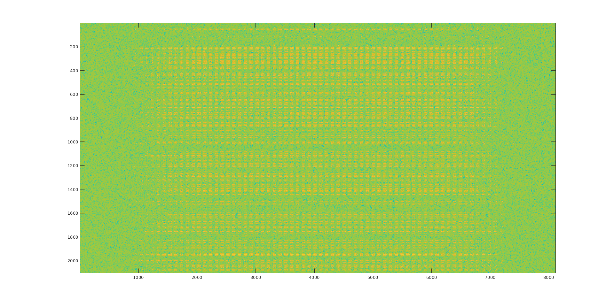

# Harvesting characters from a good quality printed book

The master strip is my_script.m

## Sample training

## Use of Tesseract

We used Tesseract to transcribe individual Chinese characters to
Unicode.  Wee demonstrated by training is that we can train a system
to **simulate Tesseract behavior** (errors and all).

## The image of the weights

We ran learning in script2k.m, on a subset of 2000 Chinese characters
The training of the neural network produces a set of weights ***W***,
which is a 2104-by-8119 matrix:

Every row of the weight matrix (i.e. of the image above)
is an image. Making it into a frame of a movie results
in this video:

## Research Problem
Classify characters using unsupervised learning

## Fix-up of page segmentation

In the file PageScan.m we have an implementation of 3 fix-up rules which handle most of
the cases (perhaps 100%) of incorrect breaking up Chinese characters into separate parts.
A significant effort went into discovery of the problems and visualization of the fix-up.
It turns out that most of the problems are created by bars (horizontal, long strokes)
at the top of the characters. 