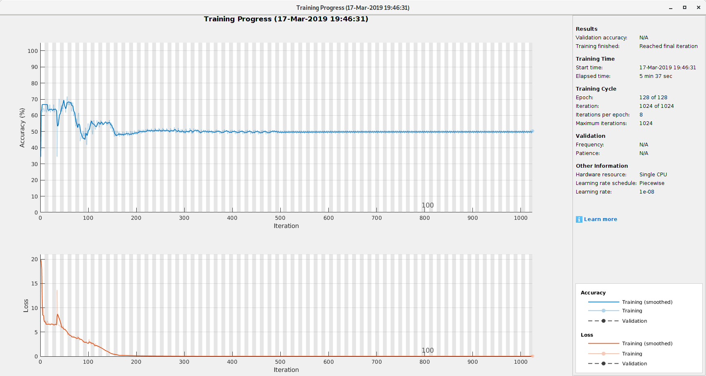

# W-lanbuage with LSTM and CTC

Connectionist Temporal Classification (CTC) has been invented by Alex Graves around 2006
for the purpose of training RNN on the label sequences that are shorter than the number of
time steps in a time series. That is, in the context of OCR, we do not need to precisely
determine the character boundaries. CTC will take care of dividing the sequence of
vertical sections into characters automatically.

In this folder there is a CTC experiment with W-language. The script [example2.m](./example2.m)
contains parameters to teach a bidirectional LSTM to recognize W-language constructs with 100%
accuracy. The non-strict W-language example allows random stretching of characters by a factor of
up to 2.

# A sample training session

